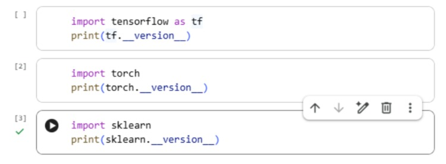

***Anexo.*** 

**Descripción:** Acceda a la herramienta **Google colaboratory** alojada en drive y ejecute la siguiente actividad. Posteriormente, responda la pregunta planteada en el foro. 

En 3 a 5 líneas responda: 

● ¿Qué es un ***framework***? 

● Nombre **uno** para IA en Python (ej: TensorFlow, PyTorch, scikit-learn).

● ¿Para qué lo usaría? 

**Intervención 2: Pruebe el *framework* en tres minutos (código mínimo, solo imprimir versión)** 

Ejecute **uno** (el que tenga instalado); pegue la salida y escriba 1 frase: “esto confirma que el *framework* está disponible”. 

- Discuta el resultado del código con sus compañeros y realicen la intervención en el foro de discusión. 
